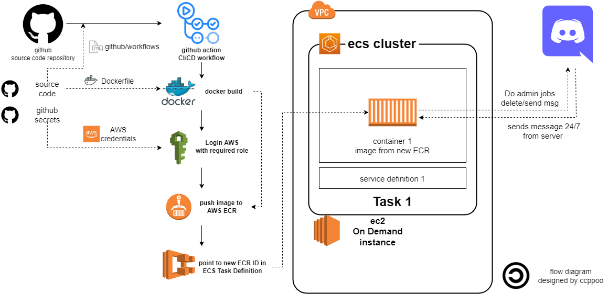
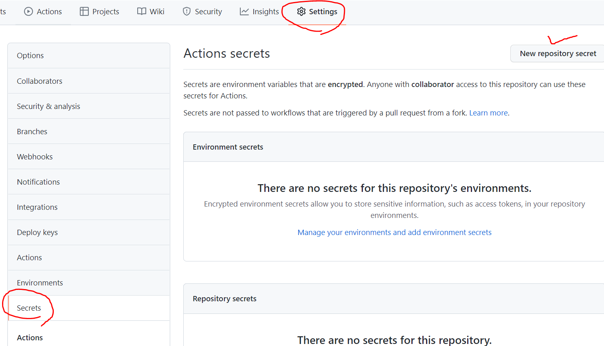
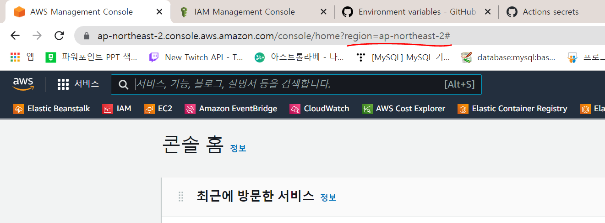
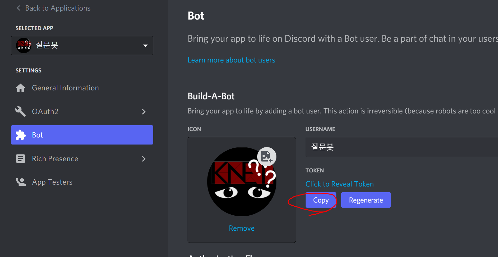
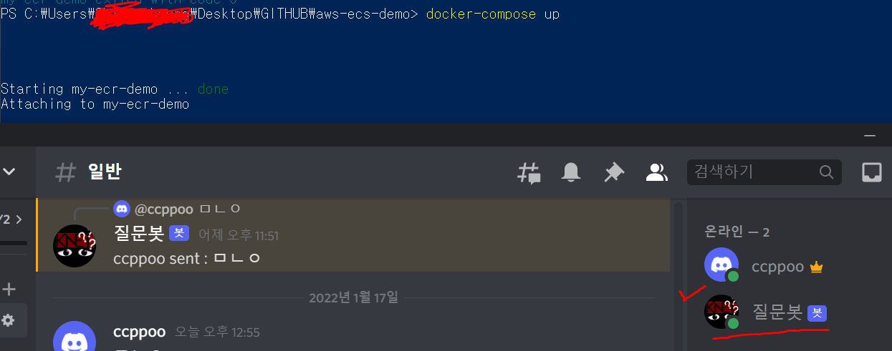

[](https://github.com/ccppoo/discord-bot "Go to GitHub repo")
[](https://github.com/ccppoo/discord-bot)
[](https://github.com/ccppoo/discord-bot)

### Languages

한글 README 읽기 - [](./readme/readme-lang/readme-ko.md)

### branches

[](./readme/branches/readme.md) - ENG

[](./readme/branches/readme-lang/branches-ko.md) - 한글

# ccppoo/discord-bot

Deploy your bot on AWS ECS

This Demo requires exprience of running bot user(a.k.a bot server) with python

This repositoty is a basic template for AWS CI/CD



by following this, you could develop bot running 24/7 via CI/CD

## File explainations

### .github/workflows/aws.yml

This file is the key part of CI/CD

After you clone or copy paste this repo, change your component name.

I made every values(name) used in yml as agrs so it could prevent typo

**Before running** `Github Action` you must fill in **Github repo Secrets**



Once you paste this value, you will not be able to read secret again

Save it some where safe just in case.

required secrets:

1. **AWS_ACCESS_KEY_ID**
   1. access key id, you will get this when making `AWS - IAM - USER`

2. **AWS_SECRET_ACCESS_KEY**
   1. access key id, you will get this when making `AWS - IAM - USER`

3. **AWS_DEFAULT_REGION**
   1. Your AWS region, could check this when you access `AWS - Management Console` (when you are logged in)



in my case, it's `ap-northeast-2`

4. **DISCORD_BOT_TOKEN**
   1. your bot app token check this at [discord/developers/applications](https://discord.com/developers/applications)



------

you will see 

### Dockerfile

This is a recipe how to set up environment and run your code

at the bottom, the enrty point, if your main script name is `main.py` then change to `CMD ["python", "main.py"]`

### Dockerfile.dev

Dockerfile for development in local environment.

I wrote how to use at `Dockerfile.dev` in local machine(Docker desktop)

it's recommanded to test with dockerfile before deploying at AWS ECS.

### docker-compose.yml

This is used for **AWS ECS** and could use for final test, **before running github action**

As we are not going to host database server docker container, we don't configure other docker images.

Before testing in local enviornment, you should add `env` args in powershell

Make a file named `env-secrets.txt`

```txt
# env-secrets.txt

$env:AWS_ACCESS_KEY_ID="<Your IAM USER KEY ID>"
$env:AWS_SECRET_ACCESS_KEY="<Your IAM User Secret Acces Key>"
$env:AWS_DEFAULT_REGION="<Your AWS region>"
$env:AWS_CONTAINER_NAME="<Your ECR Container name>"
$env:DISCORD_BOT_TOKEN="<Your discord bot app token"
```

fill in the requirements, and paste it at powershell(or shell in case of Linux/MacOS)

it will look like this if you are using PowerShell in Windows


then run `docker-compose up --build`

it could take some mintues for installing requirements

If you see `Attaching to my-ecr-demo...`

go check your bot to see it is online



Then you are ready to deploy at AWS

Once you deployed a bot to AWS, make sure to run test with **test-bot token**

because after releasing your bot will run 24/7 and you'll not want to run same bot user at the same time.

### requirements.txt

Since `pycord` didn't released 2.x.x to pypi we have to pull from repository.

other dependencies will be installed, defined at [pycord/requirements.txt](https://github.com/Pycord-Development/pycord/blob/master/requirements.txt)

### app.py

Main entry point of your bot user.

import your other scripts from `./src`

### aws-task-definition.json

paste from `AWS-ECS-Task Definition`

---

don't need port forwarding, discord bot user is client to discord

and we don't need load balancer (AWS ELB, Elastic Load Balancer)

because pycord(discord.py) is event based

If your bot serves hundreds of server, take account of Auto scaling of **AWS EC2** instance

Change **region** and **ECR, ECS services name** at `.github/workdlows/aws.yml` before running

## License

MIT

Released under [MIT](/LICENSE) by [@ccppoo](https://github.com/ccppoo).

---

badges used - [michaelcurrin/badge-generator](https://michaelcurrin.github.io/badge-generator/#/)